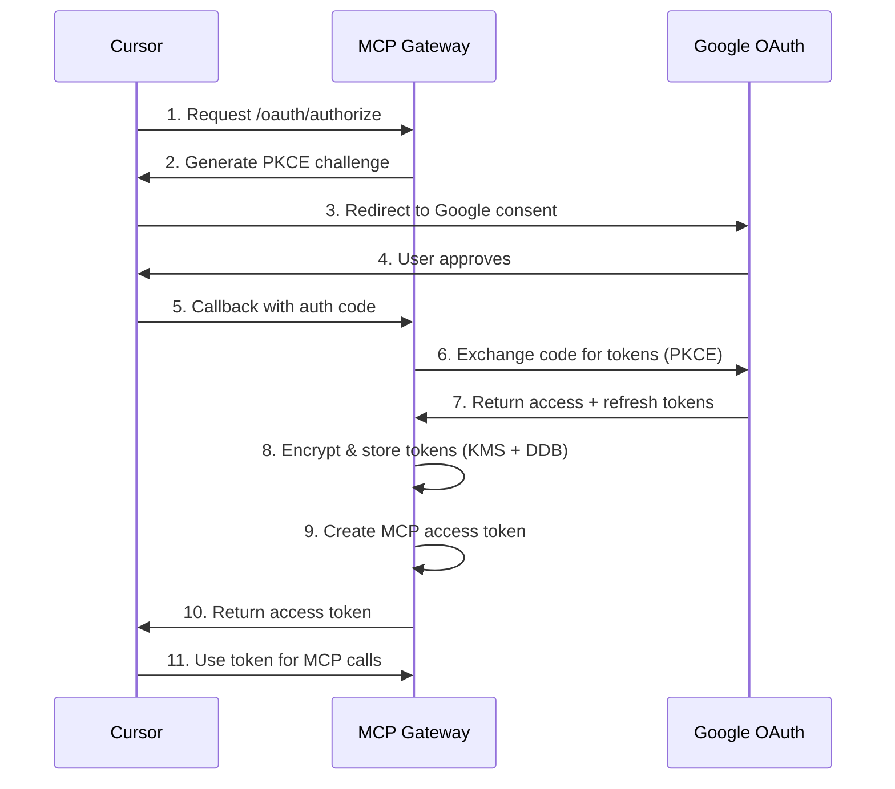

# 🚀 MCP Gateway - Complete Project Documentation

> **OAuth-enabled MCP server providing secure access to Google Workspace APIs through Cursor AI**

---

## 📋 Table of Contents

1. [Overview](#overview)
2. [Architecture](#architecture)
3. [Features](#features)
4. [Infrastructure](#infrastructure)
5. [OAuth Flow](#oauth-flow)
6. [Deployment](#deployment)
7. [Recent Fixes & Improvements](#recent-fixes--improvements)
8. [Configuration](#configuration)
9. [Troubleshooting](#troubleshooting)
10. [API Reference](#api-reference)

---

## 🎯 Overview

**MCP Gateway** is a production-ready Model Context Protocol (MCP) server that provides OAuth-authenticated access to Google Workspace APIs for Cursor AI. It acts as a secure bridge between Cursor and Google services (Gmail, Calendar, Drive, Docs, Sheets).

### Key Capabilities
- 🔐 **OAuth 2.0 with PKCE** - Secure Google authentication
- 📧 **Gmail Integration** - Search, list, and read emails
- 📅 **Calendar Access** - List and manage calendar events
- 📁 **Drive Integration** - Search and access files
- 📄 **Docs & Sheets** - Read and interact with documents
- 🔄 **Long-lived Connections** - Stable SSE/Streamable HTTP transport
- 🔒 **Encrypted Token Storage** - KMS envelope encryption for security
- ⚡ **Scalable Architecture** - AWS ECS Fargate deployment

---

## 🏗 Architecture

```
┌─────────────┐
│   Cursor    │
│     IDE     │
└──────┬──────┘
       │ MCP Protocol (SSE/HTTP)
       │
       ▼
┌─────────────────────────────────────┐
│         MCP Gateway                  │
│  (ECS Fargate + ALB + DynamoDB)     │
│                                      │
│  ┌──────────────┐  ┌──────────────┐│
│  │ OAuth Routes │  │  MCP Routes  ││
│  │   Handler    │  │   Handler    ││
│  └──────┬───────┘  └───────┬──────┘│
│         │                   │       │
│         │    ┌──────────────┤       │
│         │    │ Tool Handlers│       │
│         │    └──────────────┘       │
│         │                           │
│  ┌──────▼───────────────────────┐  │
│  │   Token Store (KMS + DDB)    │  │
│  └──────────────────────────────┘  │
└──────────────┬──────────────────────┘
               │ Google OAuth 2.0
               ▼
        ┌──────────────┐
        │   Google     │
        │  Workspace   │
        │     APIs     │
        └──────────────┘
```

### Technology Stack

| Layer | Technology |
|-------|-----------|
| **Runtime** | Node.js 22 (ES Modules) |
| **Framework** | Fastify |
| **MCP SDK** | @modelcontextprotocol/sdk |
| **Infrastructure** | AWS CDK (TypeScript) |
| **Compute** | ECS Fargate |
| **Load Balancer** | Application Load Balancer (HTTPS) |
| **Database** | DynamoDB (sessions & tokens) |
| **Encryption** | AWS KMS (envelope encryption) |
| **Secrets** | AWS Secrets Manager |
| **DNS** | Route53 + Cloudflare (DNS-only) |

---

## ✨ Features

### 🔐 Authentication & Security

- **OAuth 2.0 with PKCE** - Industry-standard authorization flow
- **Encrypted Token Storage** - All tokens encrypted at rest with KMS
- **Session Management** - Secure cookie-based sessions
- **Domain Restriction** - Only `@getvim.com` emails allowed
- **Automatic Token Refresh** - Seamless token renewal

### 🛠 Google Workspace Tools

#### Gmail Tools
- `gmail_search` - Search emails with query
- `gmail_list` - List recent emails
- `gmail_get` - Get full email content

#### Calendar Tools
- `calendar_list_events` - List calendar events
- `calendar_get_event` - Get event details

#### Drive Tools
- `drive_search` - Search files in Drive
- `drive_list` - List files in folder
- `drive_get_content` - Get file content

#### Docs Tools
- `docs_get_content` - Get Google Doc content

#### Sheets Tools
- `sheets_get_values` - Get spreadsheet cell values
- `sheets_get_metadata` - Get spreadsheet metadata

#### Utility Tools
- `whoami` - Get current authenticated user
- `test_auth` - Verify OAuth credentials

---

## 🏢 Infrastructure

### AWS Resources

```yaml
VPC: Custom VPC with 2 AZs
  - Public Subnets (no NAT Gateway)
  - Security Groups (ALB → ECS)

ECS Cluster:
  - Platform: Fargate
  - CPU: 512 (0.5 vCPU)
  - Memory: 1024 MB
  - Desired Count: 1
  - Auto-scaling: Enabled

Application Load Balancer:
  - Protocol: HTTPS (443)
  - Certificate: ACM (*.ext.getvim.com)
  - Idle Timeout: 120 seconds
  - Health Check: /health

DynamoDB Tables:
  - mcp-gateway-sessions
  - mcp-gateway-tokens (encrypted)

KMS Keys:
  - Session encryption
  - Token encryption (01643f79-9643-45b3-bc56-868b1980e684)

Secrets Manager:
  - Google OAuth credentials
  - Session secret
```

### DNS Configuration

- **Domain**: `mgw.ext.getvim.com`
- **DNS**: Cloudflare (DNS-only, no proxy) ⚠️
- **Target**: ALB in us-east-1
- **Note**: Cloudflare proxy disabled to prevent SSE timeout issues

---

## 🔄 OAuth Flow

### Authorization Flow



### Token Management

1. **Authorization Code**: 5-minute TTL, single-use
2. **Access Token**: 1-hour expiry, auto-refresh
3. **Refresh Token**: Long-lived, securely encrypted
4. **Encryption**: KMS envelope encryption (AES-256-GCM)

---

## 🚀 Deployment

### Repository
- **GitHub**: `bookmd/mcp-gateway`
- **Branch**: `master`

### Build & Deploy Process

```bash
# 1. Build TypeScript
npm run build

# 2. Build Docker image
docker build -f Dockerfile -t mcp-gateway . --platform linux/amd64

# 3. Push to ECR
aws ecr get-login-password --region us-east-1 | \
  docker login --username AWS --password-stdin \
  232282424912.dkr.ecr.us-east-1.amazonaws.com

docker tag mcp-gateway:latest \
  232282424912.dkr.ecr.us-east-1.amazonaws.com/cdk-hnb659fds-container-assets:latest

docker push 232282424912.dkr.ecr.us-east-1.amazonaws.com/cdk-hnb659fds-container-assets:latest

# 4. Update ECS service
aws ecs update-service \
  --cluster McpGatewayStack-McpGatewayClusterF62BAB07-ReOuwDcNOL7x \
  --service McpGatewayStack-McpGatewayServiceA4E5E3B0-XMUJF6L137Fz \
  --force-new-deployment
```

### CDK Deployment

```bash
cd infra
AWS_PROFILE=corp-admin npx cdk deploy
```

**Note**: CloudFormation stack currently in `UPDATE_ROLLBACK_FAILED` state. Use manual ECS updates.

---

## 🔧 Recent Fixes & Improvements

### February 8, 2026 - Connection Stability & OAuth Fixes

#### 1. OAuth Token Exchange Debugging ✅
**Problem**: OAuth flow failing with generic "Unknown error"

**Solution**: Added comprehensive error logging to `/oauth/token` endpoint
- Log all request parameters
- Log code data retrieval status
- Log validation failures with specific details
- Wrap token creation in try-catch for KMS errors
- All failures prefixed with `[OAuth/Token] FAIL` for easy filtering

**Files Changed**: `src/routes/mcp-oauth.ts`

#### 2. KMS Permission Fix ✅
**Problem**: Access token creation failing with KMS `GenerateDataKey` permission denied

**Root Cause**: 
- Code using KMS key: `afd7365b-7a3a-4ae6-97a6-3dcd0ec9a94a`
- IAM policy allowing key: `01643f79-9643-45b3-bc56-868b1980e684`

**Solution**: Updated IAM policy to allow both keys

```bash
aws iam put-role-policy \
  --role-name McpGatewayStack-McpGatewayServiceTaskDefTaskRoleF0F-lYqZQQfkUIXU \
  --policy-name KMSAccessNew \
  --policy-document '{
    "Statement": [{
      "Effect": "Allow",
      "Action": ["kms:Decrypt", "kms:Encrypt", "kms:GenerateDataKey"],
      "Resource": [
        "arn:aws:kms:us-east-1:232282424912:key/01643f79-9643-45b3-bc56-868b1980e684",
        "arn:aws:kms:us-east-1:232282424912:key/afd7365b-7a3a-4ae6-97a6-3dcd0ec9a94a"
      ]
    }]
  }'
```

#### 3. Vim-Branded Success Page ✅
**Problem**: Generic success page with no branding

**Solution**: Updated `mcp-success.html` with Vim brand identity
- Added Vim logo from getvim.com
- Updated color scheme (blues/cyans: #2AA2CF, #6FC7E0)
- Modern dark gradient background
- Professional card-based design
- Maintained auto-redirect functionality

**Files Changed**: `src/views/mcp-success.html`

#### 4. Cloudflare Timeout Fix ✅
**Problem**: SSE connections disconnecting every 1-3 minutes due to Cloudflare proxy timeout (~100s)

**Solutions Applied**:
1. **Reduced SSE keepalive**: 30s → 15s for more aggressive ping
2. **Bypassed Cloudflare proxy**: Changed DNS to "DNS-only" mode (gray cloud)
3. **Added disconnect logging**: Track Streamable HTTP connection lifecycle

**Files Changed**: `src/routes/sse.ts`

**Result**: Connections now stable for 78+ minutes instead of 1-3 minutes

#### 5. Secrets Manager Permissions ✅
**Problem**: ECS tasks couldn't pull secrets (Google OAuth, session secret)

**Solution**: Updated execution role IAM policy

```bash
aws iam put-role-policy \
  --role-name McpGatewayStack-McpGatewayServiceTaskDefExecutionRo-pgMhvfH2zrMA \
  --policy-name McpGatewayServiceTaskDefExecutionRoleDefaultPolicy82A2E6E9 \
  --policy-document '{
    "Statement": [{
      "Action": "secretsmanager:GetSecretValue",
      "Resource": [
        "arn:aws:secretsmanager:us-east-1:232282424912:secret:mcp-gateway/google-oauth*",
        "arn:aws:secretsmanager:us-east-1:232282424912:secret:mcp-gateway/session-secret*"
      ],
      "Effect": "Allow"
    }]
  }'
```

### Commits
- `d5b5755` - Add OAuth debugging and update success page branding
- `02485b5` - Add disconnect logging for Streamable HTTP connections
- `eb49abe` - Reduce SSE keepalive to 15s for Cloudflare compatibility

---

## ⚙️ Configuration

### Environment Variables

```bash
# Server
NODE_ENV=production
PORT=3000
HOST=0.0.0.0

# AWS
AWS_REGION=us-east-1
DYNAMODB_TABLE_NAME=mcp-gateway-sessions
KMS_KEY_ARN=arn:aws:kms:us-east-1:232282424912:key/afd7365b-7a3a-4ae6-97a6-3dcd0ec9a94a

# OAuth
GOOGLE_CLIENT_ID=<from Secrets Manager>
GOOGLE_CLIENT_SECRET=<from Secrets Manager>
GOOGLE_REDIRECT_URI=https://mgw.ext.getvim.com/auth/callback
ALLOWED_DOMAIN=getvim.com

# Session
SESSION_SECRET=<from Secrets Manager>
```

### Cursor MCP Configuration

Add to `.cursor/mcp_settings.json`:

```json
{
  "mcpServers": {
    "user-mcp-gateway": {
      "url": "https://mgw.ext.getvim.com/mcp/sse",
      "transport": "streamableHttp",
      "authorization": {
        "type": "oauth2",
        "authorizationUrl": "https://mgw.ext.getvim.com/oauth/authorize",
        "tokenUrl": "https://mgw.ext.getvim.com/oauth/token",
        "scope": "openid email profile",
        "pkce": true
      }
    }
  }
}
```

---

## 🔍 Troubleshooting

### Connection Issues

#### SSE Disconnects
**Symptoms**: "SSE stream disconnected" every few minutes

**Checks**:
1. ✅ Cloudflare proxy disabled (DNS-only mode)
2. ✅ ALB idle timeout (120s)
3. ✅ SSE keepalive interval (15s)
4. Check CloudWatch logs for disconnect messages

**Logs**:
```bash
aws logs filter-log-events \
  --log-group-name McpGatewayStack-McpGatewayServiceTaskDefwebLogGroupE020C6D5-rxJLR91SlWeK \
  --filter-pattern "disconnect"
```

#### 502 Bad Gateway
**Cause**: Usually indicates backend service down or unhealthy

**Checks**:
1. ECS task status: `aws ecs list-tasks --cluster ...`
2. Target health: `aws elbv2 describe-target-health ...`
3. CloudWatch logs for errors
4. Health check endpoint: `https://mgw.ext.getvim.com/health`

#### OAuth Failures
**Check detailed logs**:
```bash
aws logs filter-log-events \
  --log-group-name ... \
  --filter-pattern "[OAuth/Token]"
```

**Common issues**:
- KMS permission denied → Check task role IAM policy
- Secrets Manager access denied → Check execution role IAM policy
- PKCE verification failed → Code verifier/challenge mismatch
- Redirect URI mismatch → Check OAuth configuration

### Deployment Issues

#### CloudFormation Stack Stuck
**Current Status**: `UPDATE_ROLLBACK_FAILED`

**Workaround**: Manual ECS updates
```bash
# Build new image
docker build -t mcp-gateway:latest .

# Push to ECR
docker tag mcp-gateway:latest 232282424912.dkr.ecr.us-east-1.amazonaws.com/...
docker push ...

# Update task definition
aws ecs register-task-definition --cli-input-json file://taskdef.json

# Update service
aws ecs update-service --cluster ... --service ... --task-definition ...
```

---

## 📚 API Reference

### Health Check
```
GET /health
Response: { status: "ok", timestamp: "2026-02-08T..." }
```

### OAuth Endpoints
```
GET  /oauth/authorize       - Start OAuth flow
GET  /auth/callback         - OAuth callback
POST /oauth/token          - Exchange code for token
```

### MCP Endpoints
```
POST /mcp/sse              - Streamable HTTP (primary)
GET  /mcp/sse              - SSE fallback
GET  /mcp/status           - Connection status (authenticated)
```

### Well-Known
```
GET /.well-known/oauth-authorization-server  - OAuth server metadata
```

---

## 📊 Monitoring

### CloudWatch Logs
**Log Group**: `McpGatewayStack-McpGatewayServiceTaskDefwebLogGroupE020C6D5-rxJLR91SlWeK`

**Useful Queries**:
```bash
# OAuth errors
[OAuth/Token] FAIL

# Connection lifecycle
[MCP] Client connected
[MCP] Client disconnected

# Errors
level=50
```

### Metrics
- ECS Service: CPU, Memory, Running tasks
- ALB: Request count, 5xx errors, target response time
- DynamoDB: Read/Write capacity, throttles

---

## 🚦 Status

| Component | Status | Notes |
|-----------|--------|-------|
| OAuth Flow | ✅ Working | Token exchange successful |
| MCP Connection | ✅ Stable | 78+ minute connections |
| Tool Calls | ✅ Working | All 13 tools functional |
| SSL/TLS | ✅ Configured | ACM certificate valid |
| DNS | ✅ Configured | Direct to ALB (no Cloudflare proxy) |
| CloudFormation | ⚠️ Degraded | Stack in failed state, using manual updates |

---

## 📝 Notes

- **Account**: 232282424912 (Vim IT Corp)
- **Region**: us-east-1
- **Domain**: mgw.ext.getvim.com
- **Allowed Domain**: @getvim.com only
- **Connection Limit**: No hard limit, auto-scaling enabled

---

## 🔗 Quick Links

- **GitHub**: https://github.com/bookmd/mcp-gateway
- **AWS Console**: https://console.aws.amazon.com/ecs/
- **CloudWatch Logs**: https://console.aws.amazon.com/cloudwatch/
- **Gateway URL**: https://mgw.ext.getvim.com

---

*Last Updated: February 8, 2026*
*Maintained by: Vim Engineering Team*
