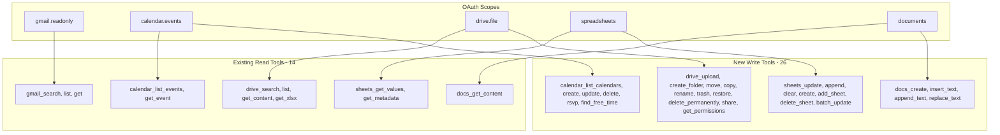

# MCP Gateway Write Operations Plan (Revised)

## Overview

Extend the MCP Gateway from 14 read-only tools to 40 total tools with write capabilities for Calendar, Sheets, Drive, and Docs.

**Excluded (per request):** Gmail write operations, Tasks service, Contacts service

## Changes from Original Plan

| Change | Reason |
|--------|--------|
| Added `calendar_list_calendars` | Users need to know which calendar to create events on |
| Changed `drive` → `drive.file` scope | More secure, only accesses app-created/opened files |
| Split `drive_delete` into `trash`/`restore`/`delete_permanently` | Safer defaults, reversible operations |
| Added input validation with Zod | Addresses production security requirements |
| Added error handling section | Quota limits, permission errors, retries |
| Added size limits documentation | Base64 upload has practical limits |

## Current State

**Existing Tools (14):**
- Gmail: `gmail_search`, `gmail_list`, `gmail_get` (read-only, unchanged)
- Calendar: `calendar_list_events`, `calendar_get_event`
- Drive: `drive_search`, `drive_list`, `drive_get_content`, `drive_get_xlsx`
- Docs: `docs_get_content`
- Sheets: `sheets_get_values`, `sheets_get_metadata`
- Auth: `whoami`, `test_auth`

---

## Phase 1: OAuth Scope Update

**File:** `src/auth/oauth-client.ts`

Update scopes to add write permissions for Calendar, Drive, Docs, and Sheets:

```typescript
scope: 'openid email profile ' +
  'https://www.googleapis.com/auth/gmail.readonly ' +      // Keep Gmail read-only
  'https://www.googleapis.com/auth/calendar.events ' +     // Create/update/delete events
  'https://www.googleapis.com/auth/drive.file ' +          // CHANGED: Only app-created/opened files (safer)
  'https://www.googleapis.com/auth/documents ' +           // Full docs access
  'https://www.googleapis.com/auth/spreadsheets'           // Full sheets access
```

**Why `drive.file` instead of `drive`:**
- `drive` = access to ALL files in user's Drive (security risk)
- `drive.file` = only files created by this app OR explicitly opened by user
- Users more likely to approve narrower scope
- Sufficient for most use cases (create, upload, share what you created)

**Note:** Users must re-authenticate after deployment to grant new permissions.

---

## Phase 2: Calendar Write Operations (6 new tools)

**Files to modify:**
- `src/calendar/types.ts` - Add event input types
- `src/calendar/handlers.ts` - Register new tools

**New Tools:**

| Tool | Description | Key Parameters |
|------|-------------|----------------|
| `calendar_list_calendars` | List user's calendars | (none) |
| `calendar_create_event` | Create new event | `calendarId?`, `summary`, `start`, `end`, `attendees?`, `location?`, `description?` |
| `calendar_update_event` | Update existing event | `eventId`, `calendarId?`, `summary?`, `start?`, `end?`, `attendees?`, `location?` |
| `calendar_delete_event` | Delete an event | `eventId`, `calendarId?`, `sendUpdates?` |
| `calendar_rsvp` | Respond to invitation | `eventId`, `calendarId?`, `response` (accepted/declined/tentative) |
| `calendar_find_free_time` | Find available slots | `attendees`, `durationMinutes`, `timeMin`, `timeMax` |

**Types to add:**
```typescript
import { z } from 'zod';

// Validation schemas
export const CalendarEventInputSchema = z.object({
  calendarId: z.string().default('primary'),
  summary: z.string().min(1).max(1024),
  start: z.union([
    z.object({ dateTime: z.string().datetime(), timeZone: z.string().optional() }),
    z.object({ date: z.string().regex(/^\d{4}-\d{2}-\d{2}$/) })
  ]),
  end: z.union([
    z.object({ dateTime: z.string().datetime(), timeZone: z.string().optional() }),
    z.object({ date: z.string().regex(/^\d{4}-\d{2}-\d{2}$/) })
  ]),
  description: z.string().max(8192).optional(),
  location: z.string().max(1024).optional(),
  attendees: z.array(z.object({
    email: z.string().email(),
    optional: z.boolean().optional()
  })).max(100).optional()
}).refine(data => {
  // Validate start < end
  const startTime = 'dateTime' in data.start ? data.start.dateTime : data.start.date;
  const endTime = 'dateTime' in data.end ? data.end.dateTime : data.end.date;
  return new Date(startTime) < new Date(endTime);
}, { message: "Start time must be before end time" });

export type CalendarEventInput = z.infer<typeof CalendarEventInputSchema>;

export interface CalendarListItem {
  id: string;
  summary: string;
  primary?: boolean;
  accessRole: 'owner' | 'writer' | 'reader' | 'freeBusyReader';
}

export interface FreeBusySlot {
  start: string;
  end: string;
}
```

---

## Phase 3: Sheets Write Operations (7 new tools)

**Files to modify:**
- `src/sheets/types.ts` - Add update types
- `src/sheets/handlers.ts` - Register new tools

**New Tools:**

| Tool | Description | Key Parameters |
|------|-------------|----------------|
| `sheets_update_values` | Write to cells | `spreadsheetId`, `range`, `values`, `valueInputOption?` |
| `sheets_append_row` | Append rows to sheet | `spreadsheetId`, `range`, `values` |
| `sheets_clear_range` | Clear cell contents | `spreadsheetId`, `range` |
| `sheets_create` | Create new spreadsheet | `title`, `sheets?` |
| `sheets_add_sheet` | Add new tab/sheet | `spreadsheetId`, `title`, `index?` |
| `sheets_delete_sheet` | Delete a tab/sheet | `spreadsheetId`, `sheetId` |
| `sheets_batch_update` | Multiple operations | `spreadsheetId`, `requests` |

**Types to add:**
```typescript
import { z } from 'zod';

export const SheetsUpdateSchema = z.object({
  spreadsheetId: z.string().min(1),
  range: z.string().min(1).max(256),
  values: z.array(z.array(z.union([z.string(), z.number(), z.boolean(), z.null()])))
    .max(1000), // Max 1000 rows per request
  valueInputOption: z.enum(['RAW', 'USER_ENTERED']).default('USER_ENTERED')
});

export type SheetsUpdateInput = z.infer<typeof SheetsUpdateSchema>;

export interface SheetsUpdateResult {
  spreadsheetId: string;
  updatedRange: string;
  updatedRows: number;
  updatedColumns: number;
  updatedCells: number;
}

export interface SheetsCreateResult {
  spreadsheetId: string;
  spreadsheetUrl: string;
  title: string;
  sheets: Array<{ sheetId: number; title: string }>;
}
```

---

## Phase 4: Drive Write Operations (9 new tools)

**Files to modify:**
- `src/drive/types.ts` - Add upload/share types
- `src/drive/handlers.ts` - Register new tools

**New Tools:**

| Tool | Description | Key Parameters | Notes |
|------|-------------|----------------|-------|
| `drive_upload` | Upload a file | `name`, `content` (base64), `mimeType`, `folderId?` | **Max 10MB** |
| `drive_create_folder` | Create folder | `name`, `parentId?` | |
| `drive_move` | Move file to folder | `fileId`, `newParentId`, `removeFromCurrent?` | |
| `drive_copy` | Copy a file | `fileId`, `name?`, `folderId?` | |
| `drive_rename` | Rename a file | `fileId`, `name` | |
| `drive_trash` | Move file to trash | `fileId` | **Safe default** |
| `drive_restore` | Restore from trash | `fileId` | |
| `drive_delete_permanently` | Permanently delete | `fileId` | **Irreversible** |
| `drive_share` | Share with user/group | `fileId`, `email`, `role`, `sendNotification?` | |
| `drive_get_permissions` | List who has access | `fileId` | |

**Types to add:**
```typescript
import { z } from 'zod';

// Upload size limit: 10MB base64 ≈ 7.5MB actual file
const MAX_BASE64_SIZE = 10 * 1024 * 1024;

export const DriveUploadSchema = z.object({
  name: z.string().min(1).max(256),
  content: z.string().max(MAX_BASE64_SIZE, 'File too large. Maximum size is 10MB base64 (~7.5MB file)'),
  mimeType: z.string().min(1),
  folderId: z.string().optional()
});

export type DriveUploadInput = z.infer<typeof DriveUploadSchema>;

export const DriveShareSchema = z.object({
  fileId: z.string().min(1),
  email: z.string().email(),
  role: z.enum(['reader', 'commenter', 'writer', 'organizer']),
  sendNotification: z.boolean().default(true)
});

export type DriveShareInput = z.infer<typeof DriveShareSchema>;

export interface DriveUploadResult {
  id: string;
  name: string;
  mimeType: string;
  webViewLink: string;
  size: string;
}

export interface DrivePermission {
  id: string;
  type: 'user' | 'group' | 'domain' | 'anyone';
  role: 'owner' | 'organizer' | 'writer' | 'commenter' | 'reader';
  emailAddress?: string;
  displayName?: string;
}
```

**Size Limits:**
- `drive_upload` accepts base64-encoded content
- Maximum base64 size: 10MB (~7.5MB actual file)
- For larger files, users should use Google Drive web interface

---

## Phase 5: Docs Write Operations (4 new tools)

**Files to modify:**
- `src/docs/types.ts` - Add document request types
- `src/docs/handlers.ts` - Register new tools

**New Tools:**

| Tool | Description | Key Parameters |
|------|-------------|----------------|
| `docs_create` | Create new document | `title`, `content?` |
| `docs_insert_text` | Insert text at position | `documentId`, `text`, `index` |
| `docs_append_text` | Append text to end | `documentId`, `text` |
| `docs_replace_text` | Find and replace | `documentId`, `find`, `replace`, `matchCase?` |

**Types to add:**
```typescript
import { z } from 'zod';

export const DocsInsertSchema = z.object({
  documentId: z.string().min(1),
  text: z.string().min(1).max(100000), // Max 100KB text per insert
  index: z.number().int().min(1)
});

export const DocsReplaceSchema = z.object({
  documentId: z.string().min(1),
  find: z.string().min(1).max(1000),
  replace: z.string().max(10000),
  matchCase: z.boolean().default(false)
});

export interface DocsCreateResult {
  documentId: string;
  title: string;
  documentUrl: string;
}

export interface DocsUpdateResult {
  documentId: string;
  replies: Array<{ insertText?: object; replaceAllText?: { occurrencesChanged: number } }>;
}
```

---

## Error Handling Strategy

All write operations should implement consistent error handling:

```typescript
// src/utils/google-api-errors.ts

import { GaxiosError } from 'gaxios';

export interface ApiError {
  code: string;
  message: string;
  retryable: boolean;
  retryAfterMs?: number;
}

export function handleGoogleApiError(error: unknown): ApiError {
  if (error instanceof GaxiosError) {
    const status = error.response?.status;
    const reason = error.response?.data?.error?.errors?.[0]?.reason;

    switch (status) {
      case 401:
        return { code: 'UNAUTHENTICATED', message: 'Token expired or invalid', retryable: false };
      case 403:
        if (reason === 'rateLimitExceeded' || reason === 'userRateLimitExceeded') {
          return { code: 'RATE_LIMITED', message: 'API rate limit exceeded', retryable: true, retryAfterMs: 60000 };
        }
        return { code: 'FORBIDDEN', message: 'Permission denied', retryable: false };
      case 404:
        return { code: 'NOT_FOUND', message: 'Resource not found', retryable: false };
      case 429:
        const retryAfter = parseInt(error.response?.headers?.['retry-after'] || '60', 10);
        return { code: 'RATE_LIMITED', message: 'Too many requests', retryable: true, retryAfterMs: retryAfter * 1000 };
      case 500:
      case 502:
      case 503:
        return { code: 'SERVER_ERROR', message: 'Google API temporarily unavailable', retryable: true, retryAfterMs: 5000 };
      default:
        return { code: 'UNKNOWN', message: error.message, retryable: false };
    }
  }
  return { code: 'UNKNOWN', message: String(error), retryable: false };
}

// Retry wrapper with exponential backoff
export async function withRetry<T>(
  operation: () => Promise<T>,
  maxRetries: number = 3
): Promise<T> {
  let lastError: ApiError | null = null;

  for (let attempt = 0; attempt < maxRetries; attempt++) {
    try {
      return await operation();
    } catch (error) {
      lastError = handleGoogleApiError(error);

      if (!lastError.retryable || attempt === maxRetries - 1) {
        throw new Error(`${lastError.code}: ${lastError.message}`);
      }

      const delay = lastError.retryAfterMs || (1000 * Math.pow(2, attempt));
      await new Promise(resolve => setTimeout(resolve, delay));
    }
  }

  throw new Error(`${lastError?.code}: ${lastError?.message}`);
}
```

---

## Architecture Diagram



---

## Summary

| Phase | Service | New Tools | Files Modified |
|-------|---------|-----------|----------------|
| 1 | OAuth | 0 | 1 |
| 2 | Calendar | 6 (+1 from original) | 2 |
| 3 | Sheets | 7 | 2 |
| 4 | Drive | 9 (+1 from original) | 2 |
| 5 | Docs | 4 | 2 |
| - | Error Handling | 0 | 1 (new file) |
| **Total** | | **26 new** | **10 files** |

**Final tool count:** 40 tools (14 existing + 26 new)

---

## Deployment Strategy

1. Implement all phases
2. Run `npm run build` to verify TypeScript compiles
3. Run tests: `npm test` (add tests for new tools)
4. Build Docker image with `--platform linux/amd64`
5. Push to ECR and update ECS task definition
6. Verify health check at https://mgw.ext.getvim.com/health
7. **Users must re-authenticate** to grant new OAuth permissions
8. Monitor logs for errors during rollout

---

## Security Considerations

1. **Narrower OAuth scope**: Using `drive.file` instead of `drive` limits blast radius
2. **Input validation**: All inputs validated with Zod schemas
3. **Size limits**: Upload operations have explicit size limits
4. **Safe defaults**: `drive_trash` instead of `drive_delete` as default
5. **Rate limiting**: Error handling includes rate limit awareness
6. **Audit trail**: All write operations logged with user email and operation details
